# Lucella High School Attendance Register.

[View the finished project here.](https://lucella-attendance-33d45b263ca9.herokuapp.com/)

Have you ever been late for your 10:00 am meeting because you were dealing with a message from school asking where your child is, when you clearly communicated at 7:00 am that they were unwell and spending the day at home being looked after by their grandparents?

Have you received messages from disgrunted parents asking why you have not yet authorised their very justified child's absence?

Attendance is a masive subject in school and a system that allows clear and easy communication between partents and school is paramamount in order not to create resentment and animosity between them.

This project has been drawn out of my own experiences as a parent, Head of a school department and school governor.

Many school apps to communicate with parents such as Class Charts or Arbor rely on school sending information out to parents without expecting any feedback from them, with the result that parents have to use emails, text messages or phone recordings to report a school abscence. 

Those messages then have to be read and recorded on the appropriate way by a member of staff that will most likely be rushed by the normal issues concerning the start of the day in a busy school. Reading messages will be the last point on the to-do list while dealing with other more pressing matters.

This results on school systems sending automated messages to parents, parents not knowing if their message was received and general pandemonium.

Taking into account that keeping accurate records of which students are in school at all times is not only a legal matter, but also a safeguarding one, it is imperative that communication on attendance is run seamlesly between school and parents.

Lucella High School Attendance Register will provide an easy way for parents to access their child's register, log in abscences and their reason, and be able to see when the absence has been authorised.
School staff will be able to see when a student has been reported as absent by their parent, while the School's Attendance officer will be able to authorise or unauthorise absences. Parents will receive an automated message when their child's abscence has been unauthorised.

## Contents

1. [Business goals.](#1-business-goals)

2. [User needs](#2-user-needs)

3. [User stories](#3-user-stories)

4. [Design](#4-design)

5. [Access to the site](#5-access-to-the-site)

6. [Student groups](#6-student-groups)

7. [Features](#7-features)

8. [Limitations of the projects and the future](#8-limitations-of-the-project-and-the-future)

9. [Testing](readme/tests.md)

    1. [Automated testing](readme/tests.md#1-automated-testing)

    2. [Manual testing](readme/tests.md#2-manual-testing)

    3. [User stories](readme/tests.md#3-user-stories)

    4. [User experience](readme/tests.md#4-user-experience)

    5. [Responsiveness](readme/tests.md#5-responsiveness)

    6. [Validation](readme/tests.md/#6-validation)

    7. [Lighthouse](readme/tests.md/#7-lighthouse)

10. [Bugs](#10-bugs)

11. [Deploynent](#11-deployment)

12. [Languages used](#12-languages-used)

13. [Frameworks, packages and libraries](#13-frameworks-packages-and-libraries)

14. [Media](#14-media)

15. [Acknowlegdements](#15-acknowledgements)

##  1. Business goals.

- To create a single point of communication between parents and school on the matter of absences.
- To provide a way for parents to easily report an absence.
- To provide a way for teachers to easily see which students have been reported absent.
- To provide a way for the Attendance Officer to easily communicate whether an absence has been authorised.
- To enhance home-school relationships by seamlessly implementing the above.

## 2. User needs.

### School staff needs.

- To be able to see which students have been reported as absent.
- To be able to  authorise absences.
- To be able to communicate unauthorised absences to parents.
- To be able to accurately report missing students to parents.

### Parents needs.

- To have a single point of communication to report an absence.
- To be able to see whether an absence has been authorised.
- To be able to see their child’s attendance record.
- To be quickly and accurately informed when their child is missing.
- To be informed when an absence has been unauthorised.

## 3. User stories.
- As a user I want to be able to log onto the site so that I can see the appropriate pages.
- As an Admission's Officer I want to be able to see the list of all registered students so that if I click on one I can see their details.
- As an Admissions Officer I want to be able to register a student so that they are on the register.
- As an Admission's Officer I want to be able to deregister a studentgit  so that records are kept up to date.
- As a teacher I want to be able to see the list of students in my class so that I can mark them on the register.
- As a teacher I want to be able to see the class attendance over the year so that I can target students with low attendance.
- As a parent I want to be able to see my child's timetable so that they are prepared for the day ahead.
- As a parent I want to be able to see my child's attendance record so that I know if I am likely to get fined by school.
- As a parent I want to be able to record my child's absence so that it can be authorised by the school.
- As a parent I want to be able to update and delete a planned absence so that if plans change my child is expected in school.
- As a parent I want to be informed when my child's absence has been unauthorised so that I can provide more information to get it authorised.
- As a parent I want to be informed when my child is missing from school so that I can find where they are.
- As an Attendance Officer I want to be able to see a record of all students' attendance so that I can target students with critical attendance.
- As an Attendance Officer I want to see all unclassified absences so that I can authorise/un-authorise them.
- As an Attendance Officer I want to be able to send an email to parents of all truanting students so that they can be accounted for.

## 4. Design

Since its conception, Lucella High School Attendance Regiter has been designed to be used in an office environment and as such, its design reflects the need for it to show information in a clear way, free of distractions and with easy navigation.

As such, navigation panels are clear on what they do and unnecesary distractions have been kept away. It is possible to return to the main landing page from all pages.

Lucella High School is part of the Piggy Before The Infection Started. For this reason, the design has been kept consistent with the series' brand.

Fonts have been kept simple and professional.

## 5. Access to the site.

Lucella High School Attendance Register is intended to be used only by registered users. It has two main type of users, parents of a student and staff members. Furthermore, users cannot register themselves as they require to be members of the organisation. On registration of a parent or teacher as a user by the Admissions Officer, they will be given the appropriate password.

On login onto the site, users will be redirected to one of two landing pages so that parents will never get access to the staff's side of the site, and staff will not get access to the parents' side of the site. Staff who are also parents would require two different login credentials.

On the staff's pages, three types of permissions have been given, teacher, Admissions Officer and Attendance officer. All users have teacher access, with the Admissions Officer and Attendance Officer having additional access to the funtionality referring to their roles.

## 6. Student groups.

In order to show flexibility in the program, the students have been grouped differently depending on which subjects they are taking. In Maths, English and Science, students are grouped by age. In sports,boys are currently playing Football, while girls are doing Athletics. In music, advanced students are doing Piano while beginners are learning Guitar. 

As the app is intended to deal with attendance, these settings have been sorted in the admin page. A new app dealing with timetables would have to be produced in order to be able to change these options on the front end.

## 7. Features

On arriving to the home page, users are directed to log in.

Teachers are directed to the landing teacher page, which presents them with a menu of activities.

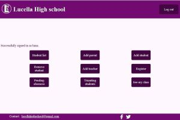

The 'Student list' button shows a list of all the students. 

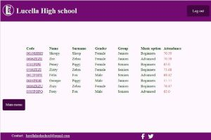

By clicking on a specific student, the attenance record of that studnent is shown. From that page, the Attendance Officer can email the appropriate parent.

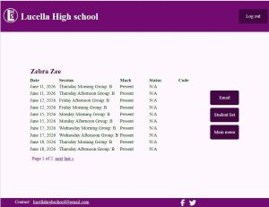

The 'Add parent' button creates a parent user. On saving, it allows to enter the parent's additional information.

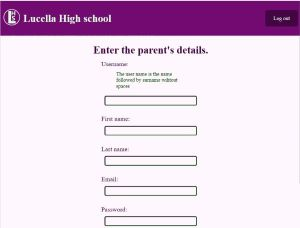  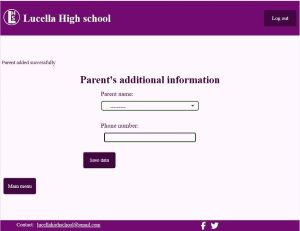

The 'Add student@ button adds a new student once their parent has been registered as a user.

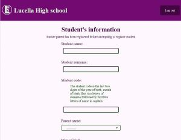

The 'Remove student' button allows the Attendance Officer to deregister a student.

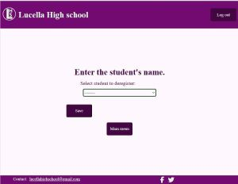

The 'Add teacher' button allows the Admissions Officer to add a new teacher. On saving, a new page to enter additional data for the teacher opens.

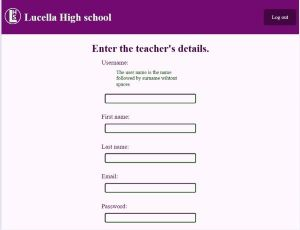 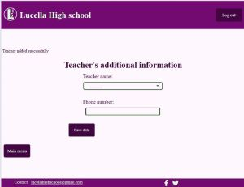

The 'Register@ button allows a teacher to input the session's details to get their register up. As the options allowed depend on the timetable, two pop up boxes on the corner show the current timetables. These boxes are for testing purposes only, as in a real situation a teacher would know what lesson they are supposed to be teaching and they would be removed in real case scenarios.

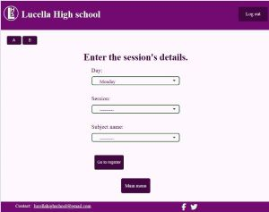 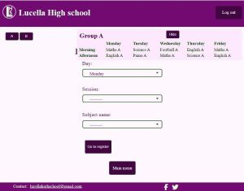

On clicking on the 'Get the register' button, a list of the class to be registered appears.

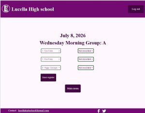

'Pending absences' pulls out a list of all the pending absences so that the Attendance Officer can review them. Clicking on a student pulls out the record for the absence. If the absence is deemed unauthorised, an email is sent to the appropriate parent when saving.

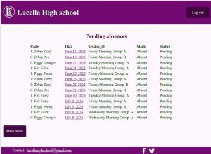 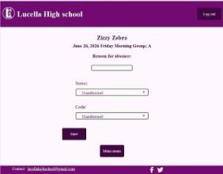

'Truanting students' allows the Attendance Officer to see the students who are absent today and whose parent has not given a reason for them not  being there. On Clicking on the email button, an email will be sent to each of the parents, requesting information about their missing child's whereabouts.

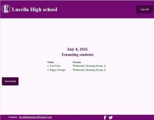

'Get my class' allows the teacher to see the overal attendance of their students in a class, as well as see the attendance record of an individual student.

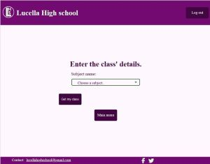 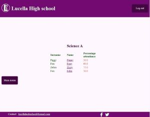

Once logged in, a parent is presented with a list of the children they have registered at the school.

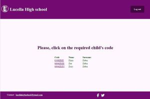

On clicking on the required child, a page with their timetable and link to attendance record appears.

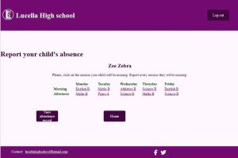

Clicking on a slot in the timetable opens a page in which the parent can report an intended absence on that slot.

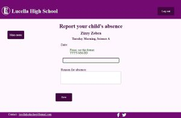

The planned absences button shows a list of all planned future absences for a child. Clicking on an individual abscence, it is possible to update or delete it if plans have changed.

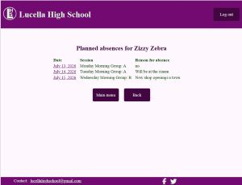
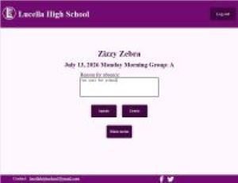

By following the attendance record, the childs attendance record appears and the parent can explain an absence in the past.

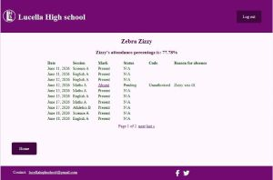 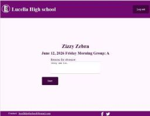

##8. Models and views.

This is the entity relationship diagram of the models used in this project.

The records for the Subject and Timetable models have been created on the Admin page, as they would have been created in the Timetable app.

The Email and Sentemail models would belong to an app to deal with communications. Email records were created on the Admin page, while Sentemail records are created whenever an email is sent but, at the moment are only accessible from the Admin page.

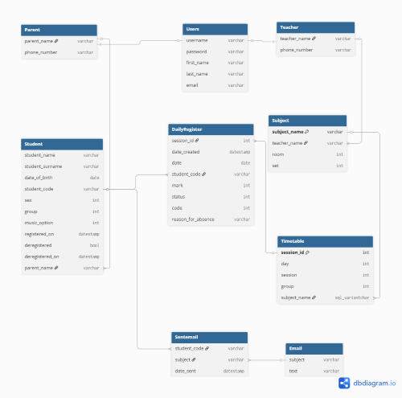

Below is a detailed list of all the views used.

|View|User|Form|Template|Function|Leads to|
|:---|:---|:---|:---|:---|:---|
|Homeview|All| |home.html|Links to login|login page|
|landing_router|--|--|--|Selects view to use depending on user permissions|landing.html|
|LandingView|teacher|-- |landing.html|Provides links to various pages|Various function pages|
|add_parent|admissions_officer|UserForm|new_parent.html|Creates a new parent user|add_parentdata.html|
|add_parentdata|admissions_officer|ParentForm|add_parentdata.html|Adds extra data to the parent user|landing.html| 
|add_student|admissions_officer|StudentForm|new_student.html|Creates a new student|landing.html|
|add_teacher|admissions_officer|UserForm|new_teacher.html|Creates a new teacher user|teacherdata.html|
|add_teacherdata|admissions_officer|TeacherForm|teacherdata.html|Adds extra data to the teacher user|landing.html|
|students_list|teacher|-- |students_list.html|Shows list of registered students and their attendances|student_detail|
|student_detail|attendance_officer|--|student-detail.html|Allows attendance officer to see detailed attendance record for student and send email if required|--|
|sendemail|attendance_officer|SendemailForm|sendemail.html|Sends email to student's parent. Creates a record of the email|landing.html|
|get_register|teacher|GetRegisterForm|get_register.html|Allows teacher to get the register for the current session|daily_register.html|
|saveregister|teacher|RegisterFormSet|daily_register.html|Allows teacher to save the register for the current session|landing.html|
|pending_absences|attendance_officer|--|pending_absences.html|Shows a list of all the pending absences|absence_detail.html|
|absence_detail|attendance_officer|PendingabsenceForm|absence_detail.html|Allows AttendanceOfficer to review an absence and sends an email to parent if appropriate|pending_absences.html|
|get_class|teacher|GetclassForm|myclass.html|Displays a list of all students in a specific subject and their attendance to that subject|class_detail.html|
|class_detail|teacher|--|class_detail.html|Displays the attendance record for a student in a specific subject|--|
|truanting_list|attendance_officer|--|truanting_list.html|Displays a list of all students truanting and allows Attendance Officer to send and email to each of their parents|landing.html|
|remove_student|admissions_officer|RemoveForm|remove_students.html|Allows the Admissions Officer to deregister a student|landing.html|
|children_list|parent|--|landing.html|Allows parent to choose one of their children to view|child_timetable.html|
|child_timetable|parent|--|child_timetable.html|Allows parent to enter a session in the timetable or view the child's attendance record|report_absence/html or child_record.html or planned_absences.html|
|report_absence|parent|AbsenceForm|report_absence.html|Allows parent to enter a reason for an absence on a session that has yet to happen|child_timetable.html|
|planned_absences|parent|--|planned_absences.html|Allows parent to see a list of all planned absences for a child|plan_detail.html|
|plan_detail|parent|GiveReasonForm|plan_detail.html|Allows parent to update or delete a planned absence|planned_absences.html||
|child_record|parent|--|child_record.html|Allows parent to see child's attendance record|give_reason.html|
|give_reason|parent|GiveReasonForm|give_reason.html|Allows parent to enter a reason for an absence that has already happened|child_record.html|

## 8. Limitations of the project and the future

When I started this project, I thought it was a pretty simple thing: students are supposed to be there, they get marked down, parents get notified. 

As I started planning, I realised that many variables needed to be accounted for. Each sbuject may have a different group of students. Subjects happen in different days of the week. Teachers come and go. There are weekends, school holidays, bank holidays... 

I realised that for this project to be able to manage all the factors, several apps would need to be produced. An admissions app, a timetable app, a calendar app, a communications app, and, of course, an attendance app.

The site has two different landing pages. One for parents and one for teachers. It would be better for each of the different teacher roles to have their own dedicated landing pages, so that they would never find a 'You don't have the required permissions' page.

Of course, attendance is not the only issue schools may want to communicate to parents. School grades, behaviour, homework, events...

Had I not been tied to a deadline, the project could have grown and grown...

May be one day, it will.

## 9. Testing

The log for all the tests done can be found here. [Lucella High School Attendance Register test log](readme/tests.md)

## 10. Bugs

### Fixed bugs.

Student_detail stopped working. Was fixed by reorganising the url order, ensuring that paths with a fixed name were first on the list and variable based ones were last.

### Unsolved bugs.

daily_register.html shows the students registered for a particular session. The drop down menu allows the teacher to mark each of the students as present or absent. When the drop down menu is used, the highlight colour is still the blue from the browser, rather that the pink colour (consinstent with the brand colours) all the other dropboxes have. This is due to the dropboxes being part of a formset rather than a simple form. While the text colour was changed to its intended green forest, neither the highlight colour nor the dropbox border settings were able to be changed during this project.

  

After sending emails to parents of truanting students, a success message appears for each of the emails sent. Several options suggested by AI were tested, but none of them worked.

## 11. Deployment

The project was managed in [github](https://github.com) and deployed to [heroku](https://id.heroku.com/login).

The process followed to deploy was:

- Once logged into Heroku, navigate to the new button on the top right corner and click on create new app.
- Give the app a name.
- Choose your location.
- Click on create app.
- From the app dashboard, click on Deploy.
- In Deployment method, select GitHub.
- Search for the repository name.
- Click on connect.
- Choose a branch to deploy from.
- Click on deploy branch.
- Move to the top of the page and click on Open app.

The app can be accessed from: https://lucella-attendance-33d45b263ca9.herokuapp.com/

To fork the project:

- On Github, mavigate to the project page: https://github.com/louisae452/Lucella-attendance-register
- Click on the fork icon.
- Select new branch.
- Give the branch a name and save.

To clone the project:

- On Github, navigate to the project page: https://github.com/louisae452/Lucella-attendance-register.
- Click on the code button.
- Copy the address shown.
- Open your code editor.
- On the terminal, navigate to the desired directory.
- Type 'git clone' followed by the address you copied.
- Press enter.

## 12. Languages used

HTML, CSS, JavaScript, Python

## 13. Frameworks, packages and libraries.

To build the site : django 

To provide a WSGI server: gunicorn 

To serve static files: whitenoise 

To access the data in the data base: psycopg2

To provide a rich-text editor: django-summernote

For enhanced authentification: django-allauth

To run automated tests: pytest

To override the browser's default blue colour in dropdown menues: Choice.js

For version control: [HitHub](https://www.github.com)

To deploy the site : [Heroku](https://dashboard.heroku.com/apps)

To debug and optimise: Google Developer Tools

To validate HTML: [w3 HTML validator](https://validator.w3.org/)

To validate CSS: [w3 CSS validator](https://jigsaw.w3.org/css-validator/)

To validate JavaScript: [JsLint](https://www.jslint.com/)S

To validate Python: [CI Pyhton Linter](https://pep8ci.herokuapp.com/)

To manipulate images: Microsoft photos

To choose icons: [Font Awesome](https://fontawesome.com/)

To convert image to webp: [ToWebP](https://towebp.io/)

To convert logo to svg: [Kittl](https://www.kittl.com/tools/svg-converter)

To draw erd diagram: [dbdiagram.io](https://dbdiagram.io/home)

Django docs.

Group permissions [geeksforgeeks](https://www.geeksforgeeks.org/python/python-user-groups-custom-permissions-django/)

To make models [sentry.io](https://sentry.io/answers/difference-between-onetoonefield-and-foreign-key-django/)

To write listview as function [geeksforgeeks](https://www.geeksforgeeks.org/python/list-view-function-based-views-django/)

To check if user belongs to group. [Stack Overflow]( https://stackoverflow.com/questions/34571880/how-to-check-in-template-if-user-belongs-to-a-group) 

To create custom tags. [geeksforgeeks](https://www.geeksforgeeks.org/python/how-to-create-custom-template-tags-in-django/)

To filter users by group. [StackOverflow](https://stackoverflow.com/questions/11118179/django-filter-users-by-group-in-a-model-foreign-key)

Formsets [Geeksforgeeks]( https://www.geeksforgeeks.org/python/django-modelformsets/)

To send emails [Geeksforgeeks](https://www.geeksforgeeks.org/python/setup-sending-email-in-django-project/)

Annotate: [Geeksforgeeks](https://www.geeksforgeeks.org/python/aggregate-vs-annotate-in-django/) and [Geeksforgeeks](https://www.geeksforgeeks.org/python/filter-objects-with-count-annotation-in-django/)

Atomic transactions [Geeksforgeeks](https://www.geeksforgeeks.org/python/transaction-atomic-with-django/)

## 14. Media

The home image and the logo were created by SuperJakeJoseCat.

## 15. Acknowledgements

This project would not have been possible without the following people:

My tutor, Kevin Loughrey who helped and encouraged me through the development of the project.

My friend and Colleague, Veronica Teodorof for always being supportive. Special thanks for a very detailed critique of the project's user experience.

My family for their unconditional support.

SuperJakeJoseCat for sharing his creativity and being my biggest fan.

[View the finished project here.](https://lucella-attendance-33d45b263ca9.herokuapp.com/)

[Return to the top](#lucella-high-school-attendance-register)