# Automated testing.
## Forms.
|Date|Form|Test|Result|Follow-up|
|:----|:----|:------|:------|:-------|
|27/06/2026|StudentForm|Form is valid when fields filled in correctly.|Pass|  |
|27/06/2026|StudentForm|Form is not valid when student_name is missing.|Pass| |
|27/06/2026|StudentForm|Form is not valid when student_surname is missing.|Pass|  |
|27/06/2026|StudentForm|Form is not valid when student_code is missing.|Pass|  |
|27/06/2026|StudentForm|Form is not valid when parent_name is not parent user.|Pass|  |
|27/06/2026|StudentForm|Form is not valid if date_of_birth format is not correct.|Pass|Add help text to form.|
|27/06/2026|StudentForm|Form is not valid if sex code is not correct.|Pass|  |
|27/06/2026|StudentForm|Form is not valid if group code is not correct.|Pass|  |
|27/06/2026|StudentForm|Form is not valid if music_option is not correct.|Pass|  |
|27/06/2026|UserForm|Form is validated if all fields are filled in.|Pass|  |
|27/06/2026|UserForm|Form is not validated if username is empty.|Pass|  |
|27/06/2026|UserForm|Form is not validated if first_name is empty.|Fail|Add required to  first_name in form. Add required to last_name and email in form.|
|27/06/2026|UserForm|Form is not validated if first_name is empty.|Pass|  |
|27/06/2026|UserForm|Form is not validated if last_name is empty.|Pass|  |
|27/06/2026|UserForm|Form is not validated if email is empty.|Pass|  |
|27/06/2026|UserForm|Form is not validated if password is empty.|Pass|  |
|27/06/2026|ParentForm|Form is valid if all fields filled correctly.|Pass|  |
|27/06/2026|ParentForm|Form is not valid if parent_name is not in parent group.|Pass|  |
|27/06/2026|ParentForm|Form is not valid if phone_number is empty.|Pass|  |
|27/06/2026|TeacherForm|Form is valid if all fields are filled correctly|Pass|  |
|27/06/2026|TeacherForm|Form is not valid if teacher_name is not user in teacher group|Pass|  |
|27/06/2026|TeacherForm|Form is not valid if phone_number is not correct|Pass|  |
|27/06/2026|GetregisterForm|Form is valid if all fields are filled correctly.|Pass|  |
|27/06/2026|GetregisterForm|Form is not valid if day option is not correct.|Pass|  |
|27/06/2026|GetregisterForm|Form is not valid if session option is not correct.|Pass|  |
|27/06/2026|GetregisterForm|Form is not valid if subject_name is not valid instance.|Pass|  |
|27/06/2026|RegisterForm|student_code is disabled on initialisation.|Pass|  |
|27/06/2026|RegisterForm|Form is valid if mark entered correctly.|Pass|  |
|27/06/2026|RegisterForm|Form is not valid if student_code is not initial value.|Pass|  |
|27/06/2026|RegisterForm|Form is not valid if mark option is not correct.|Pass|  |
|29/06/2026|SendemailForm|Form is valid if data entered correctly.|Pass|  |
|29/06/2026|SendemailForm|Form is not valid if subject option is not correct.|Pass|  |
|29/06/2026|AbsenceForm|Form is valid if data entered correctly.|Pass|  |
|29/06/2026|AbsenceForm|Form is not valid if date is not entered in the correct format.|Pass|Add help text to date.|
|29/06/2026|AbsenceForm|Form is not valid if reason_for_absence is empty.|Fail|Add required to reason_for_absence in form.|
|29/06/2026|AbsenceForm|Form is not valid if reason_for_absence is empty.|Pass|  |
|29/06/2026|GivereasonForm|Form is valid if filled in correctly.|Pass|  |
|29/06/2026|GivereasonForm|Form is not validated if an instance is not provided.|Fail|Force form to require a saved instance.|
|29/06/2026|GivereasonForm|Form is not validated if an instance is not provided.|Pass|  |
|29/06/2026|GivereasonForm|Form is not validated if reason_for_absence is empty.|Fail|Add required to reason_for_absence in form.|
|29/06/2026|GivereasonForm|Form is not validated if reason_for_absence is empty.|Pass|  |
|29/06/2026|PendingabsenceForm|Form is valid if form is filled correctly.|Pass|  |
|29/06/2026|PendingabsenceForm|Form is not valid if an instance is not provided.|Fail|Force form to require a saved instance.|
|29/06/2026|PendingabsenceForm|Form is not valid if an instance is not provided.|Pass|  |
|29/06/2026|PendingabsenceForm| Form is not valid if status option is not correct.|Pass|  |
|29/06/2026|PendingabsenceForm|Form is not valid if code option is not correct.|Pass|  |
|29/06/2026|GetclassForm|Form is valid when a valid instance is selected.|Pass|  |
|29/06/2026|GetclassForm|Form is not valid when an invalid instance is selected.|Pass|  |
|29/06/2026|RemoveForm|Queryset excludes deregistered students.|Pass|  |
|29/06/2026|RemoveForm|Form is valid when a registered student is selected.|Pass|  |
|29/06/2026|RemoveForm|Form is not valid when a deregistered student is selected.|Pass|  |

## Views

|Date|View|Test|Result|Follow-up|
|:----|:----|:------|:------|:-------|
|30/06/2026|HomeView|homeview loads successfully|Pass||
|30/06/2026|landing_router|Teacher is redirected to teachers' page|Fail|Use method decorator o request user login in landingview|
|30/06/2026|landing_router|Teacher is redirected to teacher's page|Pass| |
|30/06/2026|landing_router|Parent is redirected to parent's page|Pass| |
|30/06/2026|landing_router|Wrong user gets redirected home|Pass| |
|30/06/2026|LandingView|Non user is redirected|Pass| |
|30/06/2026|LandingView|Teacher user gets access to teacher's page|Pass| |
|30/06/2026|children_lsit|Non user cannot access parent's page|Pass| |
|30/06/2026|children_lsit|Parent user gets access and only registered children belonging to parent appear on list|Pass| |
|30/06/2026|students_list|Non user is redirected|Pass| |
|30/06/2026|students_list|Teacher user gets access and only registered children appear on list|Pass| |
|01/07/2026|add_parent|Non user is rejected|Pass| |
|01/07/2026|add_parent|Non admissions_officer user is rejected|Pass| |
|01/07/2026|add_parent|Admissions_officer user gets access to page.|Pass| |
|01/07/2026|add_parent|Form is submitted successfully|Pass| |
|01/07/2026|add_parentdata|Non user is rejected|Pass| |
|01/07/2026|add_parentdata|Non admissions_officer user is rejected|Pass| |
|01/07/2026|add_parentdata|Admissions_officer user gets access to page|Pass| |
|01/07/2026|add_parentdata|Form is submitted successfullty|Pass| |
|01/07/2026|add_student|Non user is rejected|Pass| |
|01/07/2026|add_student|Non admissions_officer user is rejected|Pass| |
|01/07/2026|add_student|Admissions_officer gets access to page|Pass| |
|01/07/2026|add_student|Form is submitted successfully|Pass| |
|01/07/2026|add_teacher|Non user is rejected| Pass| |
|01/07/2026|add_teacher|Non admissions_officer user is rejected|Pass| |
|01/07/2026|add_teacher|Admissions_officer gets access to page|Pass| |
|01/07/2026|add_teacher|Form is submitted successfully|Pass| |
|01/07/2026|add_teacherdata|Non user is rejected|Pass| |
|01/07/2026|add_teacherdata|Non admissions_officer user is rejected|Pass| |
|01/07/2026|add_teacherdata|Admissions_officer gets access to page|Pass| |
|01/07/2026|add_teacherdata|Form is submitted correctly|Pass| |
|01/07/2026|get_register|Non user is rejected|Pass| |
|01/07/2026|get_register|Non teacher user is rejected|Pass| |
|01/07/2026|get_register|Teacher user gets access to page|Pass|Do manual tests to check form is submitted correctly|
|02/07/2026|saveregister|Non user is rejected|Pass| |
|02/07/2026|saveregister|Non teacher user is rejected|Pass|Do manual tests to check teacher user gets access and form is submitted correctly |
|02/07/2026|student_detail|Non user is rejected|Pass| |
|02/07/2026|student_detail|Non attendance_officer user is rejected|Pass| |
|02/07/2026|student_detail|Attendance_officer gets access to page|Pass| |
|02/07/2026|sendemail|Non user is rejected|Pass| |
|02/07/2026|sendemail|Non attendance_officer user is rejected|Pass| |
|02/07/2026|sendemail|Attendance_officer gets access to page|Pass|Do manual tests to check email is sent correctly|
|02/07/2026|givereason|Non user is rejected|Pass| |
|02/07/2026|givereason|Non parent user is rejected|Pass| |
|02/07/2026|givereason|Parent user gets access to page|Pass|Do manual tests to check form is submitted correctly|
|02/06/2026|child_timetable|Non user is rejected|Pass| |
|02/07/2026|child_timetable|Non parent user is rejected|Pass |Do manual tests to check parent user gets access and timetable is displayed correctly|
|02/07/2026|report_absence|Non user is rejected|Pass| |
|02/07/2026|report_absence|Non parent user is rejected|Pass|Do manual tests to check parent user gets access and form is submitted correctly|
|02/07/2026|child_record|Non user is rejected|Pass| |
|02/07/2026|child_record|Non parent user is rejected|Pass|Do manual tests to check parent user gets access|
|02/07/2026|pending_absences|Non user is rejected|Pass| |
|02/07/2026|pending_absences|Non admissions_officer user is rejected|Pass| |
|02/-7/2026|pending_absences|Admissions_officer gets access to page|Pass|Do manual tests to check links redirect to correct page|
|02/07/2026|absence_detail|Non user is rejected|Pass| |
|02/07/2026|absene_detail|Non attendance_officer user is rejected|Pass|Do manual tests to check attendance_officer user gets access to page, form is submitted correctly and email is sent if appropriate|
|02/07/2026|get_class|Non user is rejected|Pass| |
|02/07/2026|get_class|Non teacher user is rejected|Pass| |
|02/07/2026|get_class|Teacher user gets access to page|Pass|Do manual tests to check llinks redirect to correct page|
|02/07/2026|class_detail|Non user is rejected|Pass| |
|02/07/2026|class_detail|Non teacher user is rejected|Pass| |
|02/07/2026|class_detail|Teacher user gets access to page|Pass| |
|02/07/2026|truanting_list|Non User is rejected|Pass| |
|02/07/2026|truanting_list|Non attendance_user is rejected|Pass| |
|02/07/2026|truanting_list|Attendance_officer gets access to page|Pass|Do manual tests to check emails are sent correctly|
|02/07/2026|remove_student|Non user is rejected|Pass| |
|02/07/2026|remove_student|Non admissions_officer is rejected|Pass| |
|02/07/2026|remove_student|Admissions_officer get access to page|Pass|Do manual tests to check form is submitted correctly|

# Manual testing

|10/07/2026| pending absence detail.  form crashes when the dropbox is filled with ---- Eliminate that forom dropbox menu. (eliminate blank=True from model)| Form can only be filled with a proper choice.

## Security

|Date|Test|Method|Expected result|Result|Follow up|
|:--|:--|:--|:--|:--|:--|
|10/07/2026|User is logged off when browser is closed|Open browser. Navigate to app. Log in. Close browser. Open it again. Navigate to app.|Should be logged off|Pass|--|
|10/07/2026|Landing page not accessible for non users|In browser, type landing page address on address bar|Home page loads|Pass|--|
|10/07/2026|Student page not accessible for non users|In browser, type student page address on address bar|Blank page with 'Main menu' button appears. 'Main menu' button leads to home page|Pass--|
|10/07/2026|Individual student page not accessible for non users|In browser, type individual existing student page.|430.html appears. 'Main menu' button leads to home page|Pass|--|
|11/07/2026|email individual student page not accessible for non users|In browser, type email individual existing student address in address bar|403.html loads. 'Main menu' button leads to home page|Pass|--|
|10/07/2026|Newparent page not accessible to non user|In browser, type newparent page address on address bar|403.html appears.'Main menu' button leads to home page|Pass|--|
|11/07/2026|parentdata page not accessible for non users|In browser, type parentdata page address on address bar|403.html loads. 'Main menu' button leads to home page|Pass--|
|10/07/2026|Newstudent page not accessible to non user|In browser, type newstudent page address on address bar|403.hml appears. 'Main menu'button leads to home page|Pass|--|
|10/07/2026|Remove page not accessible for non users|In browser, type remove page address on address bar|403.html appears. 'Main menu' button leads to home page|Pass|--|
|10/07/2026|Newteacher page not accessible for non users|In browsesr, type newteacher page address on address bar|403.html appears. 'Main menu' button leads to home page|Pass|--|
|11/07/2026|teacherdata page not accessible for non users|In browser, type teacherdata page address on address bar|403.html loads. 'Main menu' button leads to home page|Pass--|
|10/07/2026|Getregister page not accessible for non users|In browser, type getregister page address on address bar|403.html appears. 'Main menu' button leads to home page|Pass|--|
|11/07/2026|Pendingabsences page not accessible for non users|In browser, type pendingabsences page address on address bar|403.html appears. 'Main menu' button leads to home page|Pass|--|
|11/07/2026|truanting page not accessible for non users|In browser, type truanting page address on address bar|403.html appeas. 'Main menu' button leads to home page|Pass|--|
|11/07/2026|myclass page not accessible to non user|In browser, type myclass page address on address bar|403.html appears. 'Main menu' button leads to home page|Pass|--|
|11/07/2026|Individual record on my class page not accessible to non user|In browser, type the myclass address of an existing student|403.html appears.'Main button' leads to home page|Pass|--|
|11/07/2026|Individual child timetable page not accessible to non user|In browser, type existing child timetable address on address bar|403.html loads. 'Main menu' button leads to home page|Pass|--|
|11/07/2026|Future absence page not accessible for non user|In browser, type existing child future absence address on address bar|403.html loads. 'Main menu' leads to home page|Pass|--|
|11/07/2026|Individual child attendance record not accessible for non user|In browser, type existing child's attendace record on address bar|403.html loads. 'Main menu' leads to home page|Pass|--|
|11/07/2026|Givereason page not accessible for no user|On browser, type address for an existing child's absence on address bar|403.html loads. 'Main menu' leads to home page|Pass|--|
|12/07/2026|Planned absences list not accessible to non user|On browser, type address of an existing child's list of planned absences|403.html loads. 'Main menu' leads to home page|Pass|--|
|12/07/2026|Planned absence detail page not accessible to non user|On browser, type address of a planned absence for an existing child|403.html loads.'Main menu' leads to home page|Pass|--|
|13/-7.2026|saveregister not accessible to non users|On browser, type address of saveregister page on address bar|403.html loads. 'Main menu' leads to home page|Pass|--|

Further security tests can be seen in automated tests.

## Home page
|Date|Test|Method|Expected result|Result|Follow up|
|:--|:--|:--|:--|:--|:--|
|10/07/2026|Navigates to log in page|Open app. Click on 'log in' button|Log in page appears|Pass|--|
|10/07/2026|Email link directs to email program|Open app. Click on email link on footer|Email program opens. New email opens. School address is on address bar|Pass|--|

## Login page
|Date|Test|Method|Expected result|Result|Follow up|
|:--|:--|:--|:--|:--|:--|
|10/07/2026|Correct sign in|In login page, enter existing teacher Username and password|Teacher landing page opens|Pass|--|
|10/07/2026|Correct sign in|In login page, enter existing parent Username and password|Parent landing page opens|Pass|--|
|10/07/2026|Correct sign in |In login page, enter existing Username and incorrect password|Page resets|Pass|--|
|10/07/2026|Correct sign in|In login page, enter incorrect Username and password|Page resets|Pass|--|

## Teacher landing page. 
###Teacher user.
|Date|Test|Method|Expected result|Result|Follow up|
|:--|:--|:--|:--|:--|:--|
|10/07/2026|Not accessible for non users|In browser, type page address on address bar|Home page loads|Pass|--|
|10/07/2026|Success log in message|Sign in with teacher credentials|Teacher landing appears. Successfully signed in message appears|Pass|--|
|10/07/2026|'Student' list button directs to student page|Click on student list button|Student page appears|Pass|--|
|10/07/2026|Individual student is blocked|On student page, click on any student|403.html page appears|Pass|--|
|10/07/2026|'Main menu' button on individual student page redirects to correct landing page|From individual student 403 page, click on 'Main menu' button|Redirects to teacher landing page|Pass|--|
|10/07/2026|'Add parent' button|On teacher landing, click on 'Add parent' button. 'Main menu' button leads back to teacher landing|403.html appears|Pass|--|
|10/07/2026|'Add student' button|On teacher landing, click on 'Add student' button|403.html appears. 'Main menu'button leads back to teacher landing|Pass|--|
|10/07/2026|'Remove student' button|On teacher landing, click on 'Remove student'button|430.html appears. 'Main menu' button leads back to teacher landing|Pass|--|
|10/07/2026|'Add teacher' button|On teacher landing, click on 'Add teacher' button|403.html appears. 'Main menu' button leads to teacher landing page|Pass|--|
|10/07/2026|Register page loads for teacher user|On teacher landing, clik on 'Register' button|Getregister page appears|Pass|--|
|11/07/2026|Register page gives message error if timetable slot does not exist|On register page, enter details of a session that does not exist. Click on 'Save'.|An error message appears at the top of the page|Pass|--|
|11/07/2026|Button 'A' on register shows timetable A|On register page, click on button 'A'.|Timetable A appears|Pass|--|
|11/07/2026|'Hide' on timetable A  hides timetable A|On timetable A, click on 'Hide'.|Timetable A disappears|Pass|--|
|11/07/2026|Button 'B' on register shows timetable B|On register page, click on button 'B'.|Timetable B appears|Pass|--|
|11/07/2026|'Hide' on timetable B  hides timetable B|On timetable B, click on 'Hide'.|Timetable B disappears|Pass|--|
|11/07/2026|Button 'A' on register page shows timetable A and hides timetable B if it is showing|Click on button'B'. Click on button'A'|On clicking on button 'A', timetable B disappears and timetable A shows|Pass|--| 
|11/07/2026|Button 'B' on register page shows timetable B and hides timetable A if it is showing|Click on button'A'. Click on button'B'|On clicking on button 'B', timetable A disappears and timetable B shows|Pass|--|
|13/07/2026|Class register loads|On register page, enter details of an existing session for the day. Click 'Go to register'|The saveregister loads|Pass|--|
|13/07/2026|savegister submits correctly|Fill in form in saveregister. Click on 'Save Register'|Data is saved. Teacher landing loads with success message|Fail|Add success message| 
|13/07/2026|savegister submits correctly|Fill in form in saveregister. Click on 'Save Register'|Data is saved. Teacher landind loads with success message|Pass|--| 
|11/07/2026|'Pending absences' button|Click on 'Pending absences' button|403.html appears. 'Main menu' button leads back to teacher landing|Pass|--|
|11/07/2026|'Truanting students' button|Click on 'Truanting students' button|430.html appeas. 'Main menu' button leads back to teacher landing|Pass|
|11/07/2026|'See my class' button|Click on 'See my class'button|myclass page appear|Pass|--|
|11/07/2026|myclass page|Select a subject on menu. Click on 'Get my class' button|Class list should show|Fail|Fix ZeroDivisionError on get_class view|
|11/07/2026|my class page|Select a subject on menu. Click on 'Get my class' button|Class list should show|Pass|--|
|11/07/2026|my class detail|On class list, click on an individual student|A record of the student's attendance to that subject should appear|Pass|--|

### Admissions Officer user.

|Date|Test|Method|Expected result|Result|Follow up|
|:--|:--|:--|:--|:--|:--|
|11/07/2026|Individual student on studentlist is blocked|On student page, click on any student|403.html page appears|Pass|--|
|11/07/2026|'Add parent' Button|Click on 'Add parent' button|newparent page loads|Pass|--|
|11/07/2026|newparent page|Fill in form with suitable data. Click on 'Save'|Parent is saved. parentdata page loads with success message|Pass|--|
|11/07/2026|parentdata page|Fill form with suitable data. Click on 'Save data'|Data is saved. Teacher landing page loads with success message|Pass|--|
|11/07/2026|'Add student' button|Fill in form with suitable data. Click on 'Save student'|Student record is saved. Teacher landing loads with success message|Pass|--|
|11/07/2026|'Remove student' button|Select student to deregister. Click on 'Deregister'|Student is deregistered. Teacher landing loads with success message|Fail|Add success message to remove_student view|
|11/07/2026|'Remove student' button|Select student to deregister. Click on 'Deregister'|Student is deregistered. Teacher landing loads with success message|Pass|--|
|11/07/2026|'Add teacher' button|Click on 'Add teacher' Button|newteacher page loads|Pass|--|
|11/07/2026|newteacher page|Fill form with suitable data. Click on 'Save teacher'|teacherdata page loads with sucess message|Pass|--|
|11/07/2026|teacherdata page|Fill form with suitable data. Click on 'Save data'|Data is saved. Teacher landing page loads with success message|Pass|--|
|11/07/2026|'Pending absences' button|Click on 'Pending absences' button|403.html loads. 'Main menu' button leads to teacher landing|Pass|--|

|11/07/2026|'Truanting students' button|Click on 'Truanting students' button|403.html loads. 'Main menu' button leads to teacher landing|Pass|--|

### Attendance Officer user.
|Date|Test|Method|Expected result|Result|Follow up|
|:--|:--|:--|:--|:--|:--|
|11/07/2026|student detail|On student page, click on a student|The student's record appears|Pass|--|
|11/07/2026|Student detail's 'Email' button|On an individual student's attendance record, click on 'Email'|email page loads|Pass|--|
|11/07/2026|email individual student page|Select a subject for email. Click on 'Send email'|Email is sent. Teacher landing page loads with success message|Pass|--|
|11/07/2026|'Add parent' button|Click on 'Add parent' Button|403.html loads. 'Main menu' button leads to teacher landing|Pass|--|
|11/07/2026|'Add student' button|Click on 'Add student' Button|403.html loads. 'Main menu' button leads to teacher landing|Pass|--|
|11/07/2026|'Remove student' button|Click on 'Remove student' Button|403.html loads. 'Main menu' button leads to teacher landing|Pass|--|
|11/07/2026|'Add teacher' button|Click on 'Add teacher' Button|403.html loads. 'Main menu' button leads to teacher landing|Pass|--|
|11/07/2026|'Pending absences' button|Click on 'Pending absences' button|pending page loads|Fail|Correct permissions in pending_absences.html|
|11/07/2026|'Pending absences' button|Click on 'Pending absences' button|pending page loads|Pass|--|
|11/07/2026|absence detail|On pendingabsences page, click on an absence link|Individual absence page loads|Fail|Correct permissions in absence_detail.html|
|11/07/2026|absence detail|On pendingabsences page, click on an absence link|Individual absence page loads|Pass|--|
|11/07/2026|review individual unauthorised absence|On absence detail, deam an absence as unauthorised. click on 'save'|Email is sent to parent. Data is savved. Pending absences page loads whith success message|Pass|
|11/07/2026|Review individual authorised absence|On absence detail, authorise the absence|Data is saved. Pending absences page loads with sucess message|Pass|--|
|13/07/2026|'Truanting students' button|On teacher landing, click on 'Truanting students'.|The list of today's truanting students appears|Pass|--|
|13/07/2026|'Send email' button|On truanting page, click on 'Send email'|An email to each student's parent on the list is sent. Teacher page loads with success mesage|Pass|--|

## Parent landing page.
|Date|Test|Method|Expected result|Result|Follow up|
|:--|:--|:--|:--|:--|:--|
|11/07/2026|Success log in message|Sign in with parent credentials|Parent landing loads with success message|Pass|--|
|11/07/2026|View child's page|Click on child's link|Child's timetable page loads|Pass|--|
|11/07/2026|Future absence page loads|On child's timetable page, click on timetable link|Future absence page loads|Pass|--|
|11/07/2026|Future absence page saves|Fill in form wih suitable information.|Absence is saved. Timetable page loads with sucess message|Pass|--|
|12/07/2026|'Planned absences button'|On child's timetable page, clic on 'Planned absences'button|A list of all the planned absences load|Pass|--|
|12/07/2026|Planned absence detail|On planned absences list, click on the link for a planned absence|Details of the absence load|Pass|--|
|12/07/2026|Update planned absence|On absence detail, change the reason for absence field. Click on 'Update'|The new data is saved. Planned absences list loads with success message|Pass|--|
|12/07/2026|Delete planned absence|On absence detail, click on 'Delete'|A confirmation box appears.|Pass|--|
|12/07/2026|Confirm delete|On confirmation box, click on 'Delete'|The message is deleted. Planned absences list loads with success message|Pass--|
|12/-7/2026|Cancel delete|On confirmation box, click on 'Cancel'|The confirmation box disappears|Pass|--|
|11/07/2026|'View attendance record' button|On child's timetable page, click on 'View attendance record'|Child's record page loads|Pass|--|
|11/07/2026|givereason page loads|on child's attendance record, click on an absent record link|Givereason page loads|Pass|--|
|11/07/2026|givereason page submits information|Fill in form. Click on 'Save'|Data is saved. Status for absence is set to pending. Child's attendance record page loads with success message|--|

Note: Automated tests for all forms have been done. Manual tests for forms have done for successful submission and special cases.

# User stories

- Users can log onto the site and see the appropriate pages.
- The Admission's Officer can see the list of all the registered students. They can register and deregister students. They can also register teachers.
- The Attendance Officer can see all pending absences and review them. They can email the parent when they unauthorise an absence and when their child's attendance is below the recommended levels.
- The Attendance Officer can also see a list of the students truanting on a specific day and email their parents.
- Teachers can pull up the register for the session occurring and register their students. They can see their students' attendance over the year.
- Parents can see their child's timetable and report an absence for a time that has not yet happened.They can see the list of planned absences and update or delete absences as required. They can see their child's attendance record over the year and explain an absence that took place in the past.
- Parents are also informed by email when their child's attendance goes below a recommended level, when an absence is unauthorised and when their child is truanting.

# User experience.

The following issues were reported by users.

|Date|Issue|Template|View/Form|Action taken|
|:--|:--|:--|:--|:--|
|10/07/2026|'Home' button in parents pages is misleading|child_record.html, child_timetable.html, give_reason.html, report_absence.html|--|The text in the button was changed to 'Main menu'|
|10/07/2026|There is no way to get out of givereason page unless saving|give_reason.html|--|'Back to absence record' and 'Main menu' buttons were added|
|10/07/2026|In the reportabsence page, when the date does not match the session, after attempting to save, the user is redirected to the timetable page|report_absence.html|report_absence|The redirect was changed to go back to the reportabsence page|
|12/07/2026|Get register page does not make clear that only lessons occurring on that day can be registered|get_register.html|--|Added help text to page|
|12/07/2026|When you deregister a student, the button to submit says 'Save'. It should say 'Deregister'|remove_student.html|--|Changed text on button|
|12/07/2026|Phone field entries do not validate correctly|parentdata.html, teacherdata.html|ParentForm, TeacherForm|Updated phone fields in models to CharField, updated forms to only accept phoneformat|
|No feedback when there are no truanting students|truanting.html|--|Added message to empty list|
|12/07/2026|It is not possible to delete a planned absence|planned_absences.html, plan_detail.html|planned_absences, plan_detail|Created new views and templates|
|13/-7/2026|Messages difficult to see|base.html|--|Encased messages in a box|

# Responsiveness

The game was tested on the following devices:

Inspiron 16 laptop:

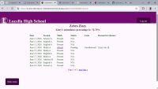

 

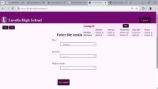
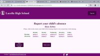

Ipad Air 5th generation:

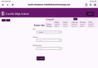 &nbsp; &nbsp; 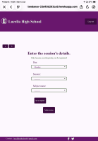

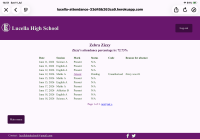 &nbsp; &nbsp; 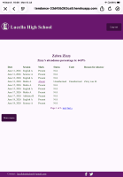

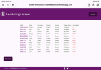 &nbsp; &nbsp; 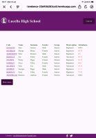

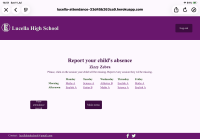 &nbsp; &nbsp; 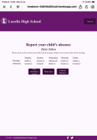

Samsung Galaxy S25 phone:

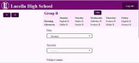 &nbsp; &nbsp; 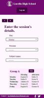

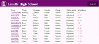 &nbsp; &nbsp; 

 &nbsp; &nbsp; 

# Validation

## HTML

All html pages were run through the [W3C HTML validator](https://validator.w3.org/#validate_by_input). Errors were corrected.
One warning remains in absence_detail. This refers to the empty box in the form when a parent has not given a reason for their child absence.

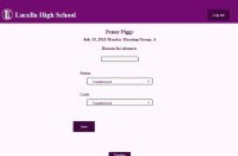

 

